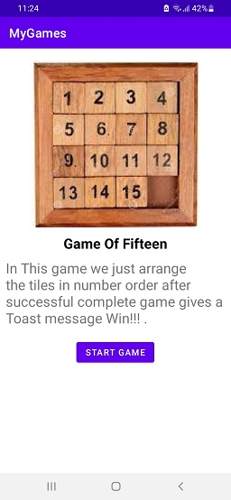

# MyGames - Mini Game Collection

## Table of Contents

- [Introduction](#introduction)
- [Features](#features)
- [Screenshots](#screenshots)
- [Technologies Used](#technologies-used)
- [Contributing](#contributing)
- [License](#license)

## Introduction

MyGames is a collection of simple and fun mini-games for Android. It was developed as a project for a college course and showcases different game mechanics and concepts. The app is designed to be lightweight, easy to use, and enjoyable for users of all ages.

## Features

- Four engaging mini-games:
  - Magic Card Game
  - Game of Fifteen
  - Number Guessing Game
  - Rock Paper Scissors
- User-friendly interface.
- Background music to enhance the gaming experience.
- Contact the developer for feedback or inquiries.
- Clean and organized codebase for easy understanding and modification.

## Screenshots

## Technologies Used

- Java
- Android Studio
- XML

## License

This project is licensed under the MIT License - see the [LICENSE](LICENSE) file for details.
