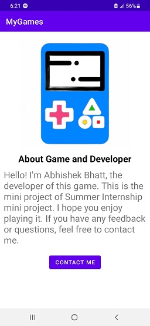

# MyGames - Mini Game Collection

## Table of Contents

- [Introduction](#introduction)
- [Features](#features)
- [Screenshots](#screenshots)
- [Technologies Used](#technologies-used)
- [Contributing](#contributing)
- [License](#license)

## Introduction

This project was developed as part of my Summer Internship during the 7th semester of my Bachelor's in IT Engineering (B.E.) program. It's a collection of mini-games designed to showcase various aspects of mobile app development.

Through this mini project, I aim to demonstrate my skills in creating interactive and entertaining mobile applications for Android devices. Each mini-game included here represents a unique challenge, offering a glimpse into the world of app development.

MyGames is a collection of simple and fun mini-games for Android. It was developed as a project for a college course and showcases different game mechanics and concepts. The app is designed to be lightweight, easy to use, and enjoyable for users of all ages.

## Features

- Four engaging mini-games:
  - Magic Card Game
  - Game of Fifteen
  - Number Guessing Game
  - Rock Paper Scissors
- User-friendly interface.
- Background music to enhance the gaming experience.
- Contact the developer for feedback or inquiries.
- Clean and organized codebase for easy understanding and modification.

## Screenshots

## Demo Video

Watch a brief demo of the MyGames app in action:

[]

## Technologies Used

- Java
- Android Studio
- XML

